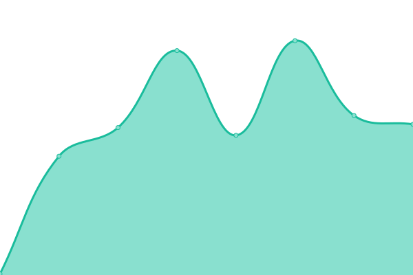

# [📈 Live Status](https://rafaelsandroni.github.io/status): <!--live status--> **🟧 Partial outage**

This repository contains the open-source uptime monitor and status page for [Rafael Sandroni](https://rafaelsandroni.github.io/status), powered by [Upptime](https://github.com/upptime/upptime).

With [Upptime](https://upptime.js.org), you can get your own unlimited and free uptime monitor and status page, powered entirely by a GitHub repository. We use [Issues](https://github.com/rafaelsandroni/status/issues) as incident reports, [Actions](https://github.com/rafaelsandroni/status/actions) as uptime monitors, and [Pages](https://rafaelsandroni.github.io/status) for the status page.

<!--start: status pages-->
<!-- This summary is generated by Upptime (https://github.com/upptime/upptime) -->
<!-- Do not edit this manually, your changes will be overwritten -->
<!-- prettier-ignore -->
| URL | Status | History | Response Time | Uptime |
| --- | ------ | ------- | ------------- | ------ |
|  [Metatext (metatext.ai)](https://metatext.ai) | 🟩 Up | [metatext-metatext-ai.yml](https://github.com/metatext/status/commits/HEAD/history/metatext-metatext-ai.yml) | 

 149ms
     
 | 

<a href="https://status.metatext.io/history/metatext-metatext-ai">100.00%</a>
    

|  [Metatext App (app.metatext.ai)](https://app.metatext.ai) | 🟩 Up | [metatext-app-app-metatext-ai.yml](https://github.com/metatext/status/commits/HEAD/history/metatext-app-app-metatext-ai.yml) | 

 142ms
     
 | 

<a href="https://status.metatext.io/history/metatext-app-app-metatext-ai">100.00%</a>
    

|  Training API (api.metatext.ai/v1/training) | 🟩 Up | [training-api-api-metatext-ai-v1-training.yml](https://github.com/metatext/status/commits/HEAD/history/training-api-api-metatext-ai-v1-training.yml) | 

 414ms
     
 | 

<a href="https://status.metatext.io/history/training-api-api-metatext-ai-v1-training">100.00%</a>
    

|  Inference API (api.metatext.ai/v1/models) | 🟩 Up | [inference-api-api-metatext-ai-v1-models.yml](https://github.com/metatext/status/commits/HEAD/history/inference-api-api-metatext-ai-v1-models.yml) | 

 143ms
     
 | 

<a href="https://status.metatext.io/history/inference-api-api-metatext-ai-v1-models">100.00%</a>
    

|  PIPELINE API | 🟥 Down | [pipeline-api.yml](https://github.com/metatext/status/commits/HEAD/history/pipeline-api.yml) | 

 0ms
     
 | 

<a href="https://status.metatext.io/history/pipeline-api">100.00%</a>
    

<!--end: status pages-->

[**Visit our status website →**](https://rafaelsandroni.github.io/status)

## 📄 License

- Powered by: [Upptime](https://github.com/upptime/upptime)
- Code: [MIT](./LICENSE) © [Rafael Sandroni](https://rafaelsandroni.github.io/status)
- Data in the `./history` directory: [Open Database License](https://opendatacommons.org/licenses/odbl/1-0/)
